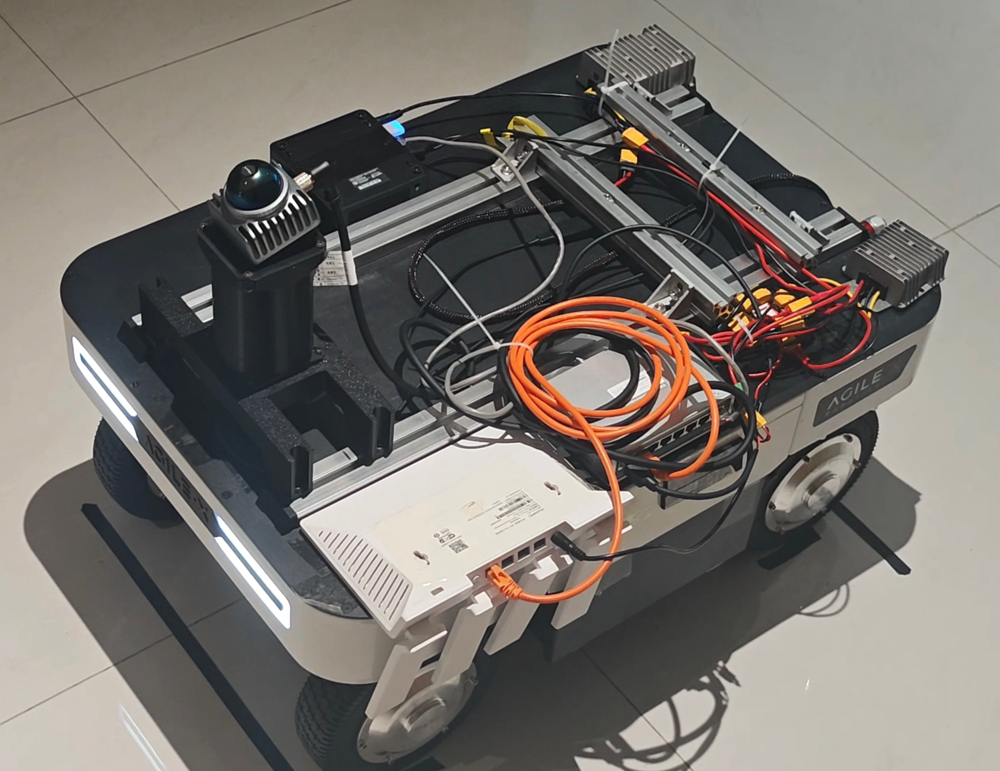

# Dual-Ackermann Four-State DARE-LQR Controller

面向 ROS 2 `nav_core` 框架的双阿克曼路径跟踪控制器。控制器采用四状态离散代数黎卡提方程在线求解反馈增益，并结合路径曲率前馈、正倒车统一运动坐标系、短预瞄转向、长预瞄速度规划、底盘执行模型补偿和 `base_link` 终点停车。

> 当前 Ranger Mini V3 实车配置：正向和倒向均以 `base_link` 为跟踪与停车参考点，终点位置误差要求为 `1 cm`。

> [Ranger Mini V3 效果视频](https://www.xiaohongshu.com/explore/6a51df110000000021018133?xsec_token=AB68jAZqpw4yHAFrqr9d0r3AACLUZA5kRXH2MK-Ds1yCQ=&xsec_source=pc_user)



## 1. 主要特性

- 四状态在线 DARE-LQR：状态为 `[e_y, e_y_dot, e_psi, e_psi_dot]`。
- 前馈与反馈解耦：底盘逆模型只补偿路径曲率前馈，不放大 LQR 反馈和定位噪声。
- 正倒车统一运动坐标系：正向、倒向共用同一套误差定义和控制律。
- 双层预瞄：短预瞄负责转向前馈，长预瞄负责弯前速度规划。
- 底盘适配参数集中：几何、速度、转向增益、延迟、动态和制动模型集中在 YAML 前部。
- 误差阈值集中：路径捕获、重新捕获、停车和直线稳定阈值单独归组。
- 自然终点速度：2 m 外尽可能保持 1 m/s，最后阶段按剩余纵向距离连续、单调减速。
- 统一终点参考：跟踪、减速、停车和误差打印均使用 `base_link -> base_link`。
- 不增加额外停车动作：满足 1 cm 窗口后直接发布零速度并锁存。

## 2. 控制流程

```text
局部 base_link 控制路径
        ↓
正/倒车统一到运动坐标系
        ↓
最近线段投影：e_y、e_psi、路径进度 s
        ↓
短预瞄曲率 + 底盘转向延迟补偿
        ↓
底盘角速度执行增益逆模型，仅补偿曲率前馈
        ↓
长预瞄弯道速度、误差限速和路径捕获速度
        ↓
终点自然速度曲线与实测制动包络
        ↓
按当前允许速度构造 A、B 并在线求解 DARE
        ↓
中央转角 = 前馈 + LQR反馈 + 小幅方向补偿
        ↓
曲率速率限制、双阿克曼几何换算、指令平滑
        ↓
/cmd_vel
```

## 3. 参数文件结构

所有参数仍位于单一文件：

```text
config/controller.yaml
```

未拆分新的源文件或配置文件。YAML 按以下顺序组织：

1. 插件注册；
2. 底盘速度、几何和转向约束；
3. 底盘静态执行模型；
4. 底盘动态、制动和方向差异；
5. 误差、状态和精度阈值；
6. 四状态 DARE-LQR 参数；
7. 路径参考、短预瞄和曲率前馈；
8. 弯道速度规划和出弯恢复；
9. 终点自然驶入、对齐和停车；
10. 曲率与速度平滑；
11. 控制周期。

### 3.1 更换底盘时优先修改

优先只修改 YAML 的第 1～3 组：

```yaml
# 速度与几何
target_linear_velocity
max_linear_velocity
max_angular_velocity
max_linear_acceleration
max_linear_deceleration
wheel_base
track_width
max_steering_angle
min_turning_radius

# 转向静态模型
empirical_yaw_rate_breakpoints
empirical_yaw_rate_gains
positive_curvature_steering_delay
negative_curvature_steering_delay
straight_steering_bias_central_angle

# 动态与制动模型
empirical_max_yaw_acceleration
empirical_sign_change_max_yaw_acceleration
empirical_terminal_max_yaw_acceleration
empirical_braking_quadratic_coefficient
empirical_braking_linear_coefficient
```

更换底盘后不建议首先修改 Q、R。应先完成几何参数、角速度增益、转向延迟、低速可控速度和制动距离辨识，再根据闭环误差调整 LQR 权重。

### 3.2 定位或精度要求变化时修改

误差和阈值集中在 YAML 第 4 组，包括：

```yaml
lateral_error_limit
heading_error_limit
lateral_error_deadband
heading_error_deadband
path_acquisition_*
path_reacquisition_*
terminal_stop_distance
terminal_stop_s_tolerance
terminal_stop_lateral_tolerance
terminal_alignment_*
```

当前停车要求：

```text
dist <= 0.010 m
|s|  <= 0.010 m
|cte| <= 0.010 m
```

其中 `dist`、`s` 和 `cte` 都基于目标 `base_link` 与当前 `base_link` 计算。

## 4. 四状态 DARE-LQR

状态向量：

```math
X_k=[e_y,\dot e_y,e_\psi,\dot e_\psi]^T
```

控制输入为相对于曲率前馈中央转角的修正量：

```math
u_k=\Delta\phi_k
```

最终中央转角：

```math
\phi_{cmd}=\phi_{ff,comp}+\Delta\phi_{LQR}+\phi_{bias}+\phi_{terminal}
```

离散模型：

```math
X_{k+1}=A(v,\Delta t)X_k+B(v,\phi_{ff})\Delta\phi_k
```

默认代价矩阵：

```math
Q=diag(12.0,0.30,10.0,0.25),\qquad R=4.2
```

对应 YAML：

```yaml
lqr_q_lateral: 12.0
lqr_q_lateral_rate: 0.30
lqr_q_heading: 10.0
lqr_q_heading_rate: 0.25
lqr_r_steering: 4.2
```

## 5. 双阿克曼几何

中央转角与曲率关系：

```math
\kappa=\frac{2\tan\phi}{L}
```

```math
\phi=\arctan\left(\frac{L\kappa}{2}\right)
```

源码根据 `wheel_base`、`track_width`、`max_steering_angle` 和 `min_turning_radius` 在线计算最大中央转角和最大曲率。更换底盘时不需要修改控制算法，只需要更新几何参数和命令接口约束。

## 6. 预瞄与速度规划

短预瞄根据速度计算未来曲率，用于提前转向和提前回正：

```math
D_{short}=clip(D_{min}+k_v|v|,D_{min},D_{max})
```

长预瞄只用于弯道速度规划：

```math
v_{curve}=\sqrt{\frac{a_{y,max}}{|\kappa_{peak}|}}
```

路径捕获状态只在初始横向/朝向偏差明显较大或重新偏离路径时启用。捕获阶段不直接用高增益把机器人拉向最近点，而是生成一个有界的渐近并入航向，并降低横向反馈权重与速度上限，从而避免越过路径后反向修正形成 S 形振荡：

```yaml
path_acquisition_enter_lateral_error: 0.050
path_acquisition_exit_lateral_error: 0.012
path_acquisition_min_speed: 0.250
path_acquisition_max_speed: 0.700
path_acquisition_stable_cycles: 5
path_acquisition_convergence_heading_gain: 0.80
path_acquisition_convergence_heading_max: 0.140
path_acquisition_lateral_feedback_scale: 0.45
path_acquisition_feedback_scale: 0.75
```

进入路径后连续 5 个周期满足退出误差，捕获状态关闭，速度再按正常加速度约束平滑恢复到 1 m/s。正常厘米级跟踪不会触发该低速并入过程。

进入真实终点的单调减速区域后，路径捕获状态会强制交接给终点对齐、倒向直线稳定和严格停车判定。路径捕获的虚拟并入航向与降权反馈不会进入最终停车阶段，因此不会再覆盖已经验证有效的 1 cm 停车功能。

## 7. 终点自然驶入

正常直线和误差较小时，控制器尽可能保持：

```yaml
target_linear_velocity: 1.00
max_linear_velocity: 1.00
```

进入最后 2 m 后，速度上限按终点切线方向剩余距离连续下降：

```math
v_{terminal}=min(1.0,0.5s)
```

典型速度：

| 剩余纵向距离 | 速度上限 |
|---:|---:|
| 2.0 m | 1.00 m/s |
| 1.0 m | 0.50 m/s |
| 0.5 m | 0.25 m/s |
| 0.2 m | 0.10 m/s |
| 0.1 m | 0.05 m/s |
| 满足 1 cm 窗口 | 0 m/s |

最后 2.2 m 内启用单调速度包络，速度上限只允许下降，避免定位或曲率波动造成“减速—加速—再减速”。

## 8. 正倒车控制

路径先转换到统一运动坐标系，因此基础 LQR、前馈和终点误差定义不区分正倒车。

当前底盘在倒向直线和低速终点存在额外方向差异，相关参数集中在 YAML 的“底盘动态、制动与方向差异”组。更换方向对称性更好的底盘时，可以关闭：

```yaml
reverse_straight_stabilization_enable: false
reverse_convergence_heading_enable: false
reverse_terminal_lateral_convergence_enable: false
```

正向和倒向停车仍使用同一个目标 `base_link` 和同一个 1 cm 误差窗口。

## 9. 诊断话题

- `/lqr/lookahead_point`：普通前瞻点。
- `/lqr/tracking_error`：控制诊断数组。

主要索引：

| 索引 | 含义 |
|---:|---|
| 0 | 横向误差 `e_y` |
| 1 | 航向误差 `e_psi` |
| 2 | 终点距离 `dist` |
| 3 | 线速度指令 |
| 4 | 角速度指令 |
| 5～8 | 四个 LQR 反馈增益 |
| 16 | 终点纵向误差 `s` |
| 17 | 终点横向误差 `cte` |
| 18 | 停车锁存状态 |
| 19～24 | 当前、预瞄、前馈和输出曲率 |
| 25 | 底盘角速度执行增益 |
| 26 | 前馈补偿倍率 |
| 27 | 转向延迟附加预瞄距离 |
| 30 | 当前曲率变化率限制 |
| 31 | 出弯恢复剩余距离 |
| 33 | 倒向目标收敛航向 |
| 34 | 倒向直线速度上限 |
| 35 | 倒向稳定器状态 |
| 36 | 终点单调速度上限 |
| 37 | 路径捕获渐近并入目标航向 |

满足停车条件时只打印一次：

```text
FINAL BASE_LINK STOP: dist=..., required<=0.0100 m, s=..., cte=...
```

## 10. 编译

将目录放入工作区：

```text
~/neu_nav_ws/src/controller/lqr
```

执行：

```bash
cd ~/neu_nav_ws
source /opt/ros/humble/setup.bash
rm -rf build/lqr install/lqr
colcon build --packages-select lqr --symlink-install
source install/setup.bash
```

运行前可检查主要参数：

```bash
ros2 param get /nav_core target_linear_velocity
ros2 param get /nav_core path_acquisition_max_speed
ros2 param get /nav_core terminal_stop_distance
ros2 param get /nav_core control_period
```

## 11. 使用边界

- `control_period` 必须与 `nav_core` 实际控制周期一致。
- 当前 `cmd_vel.angular.z` 的生成方式与双阿克曼命令适配器一致；更换底盘时必须确认新底盘如何解释角速度和转向比值。
- 底盘辨识参数属于平台配置，不应通过增大 Q、R 代替。
- 终点停车基于定位系统计算出的 `base_link` 位姿，定位噪声会直接影响厘米级停车重复性。
